## 一、Java类及其加载过程

### 平台无关性如何实现(一次编译，随处运行)

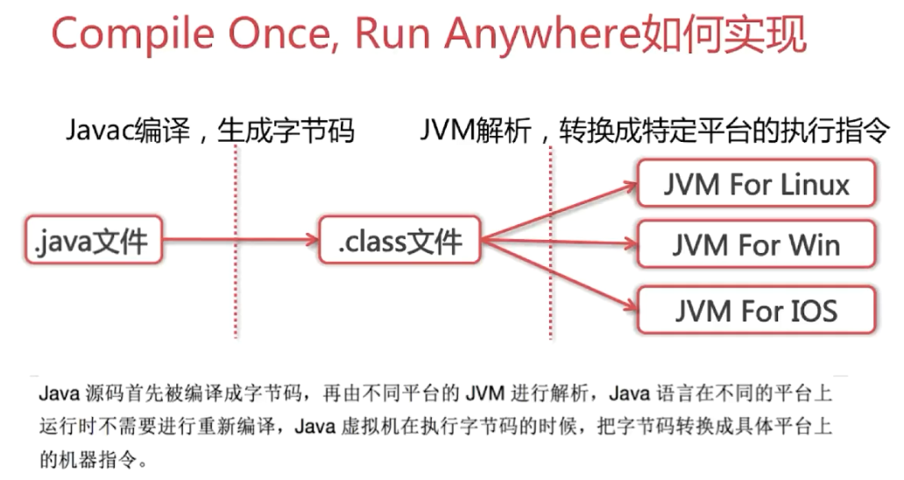


### 为什么JVM不直接讲源码解析成机器码去执行

（1）准备工作：每次执行都需要各种检查

​	若是直接编译成机器码，那么每次还都要进行语法，句法、语义的检查，即每次的结果都不会保存起来，需要重新编译，重新分析，整体的性能会受到影响，做了很多重复的事情，因而引入中间字节码，能够保证在被编译成字节码之后，多次执行程序不需要进行校验和补全。

（2）兼容性：也可以将别的语言解析成字节码

 	可以将scala等大家熟悉的语言，解析成字节码，然后由jvm进行调用，进而增加软件平台的扩展性。

### JVM如何加载class文件

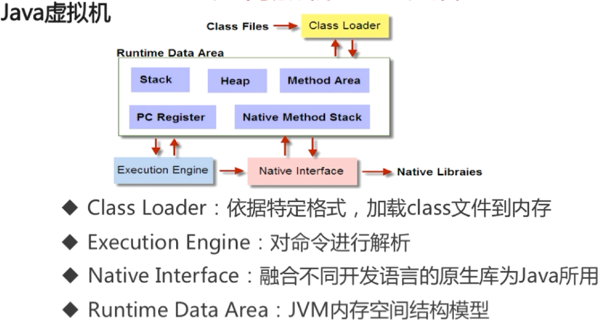


### 什么是反射

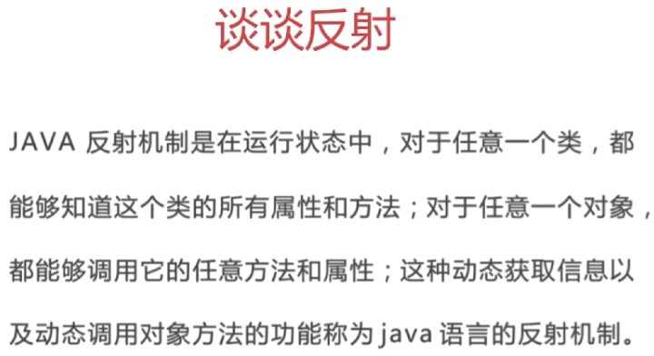

```java
public class Robot {
    private String name;
    public void sayHi(String helloSentence){
        System.out.println(helloSentence + " " + name);
    }
    private String throwHello(String tag){
        return "Hello " + tag;
    }
    static {
        System.out.println("Hello Robot");
    }
}
```

获取Robot私有方法的例子：

```java
public class ReflectSample {
    public static void main(String[] args){
        Class rc = Class.forName("com.interview.javabasic.reflect.Robot");
        Robot r = (Robot) rc.newInstance();
        System.out.println("Class name is " + rc.getName());
        Method getHello = rc.getDeclaredMethod("throwHello", String.class);
        // 运行时，动态改变访问权限
        getHello.setAccessible(true);
        Object str = getHello.invoke(r, "Bob");
        System.out.println("getHello result is " + str);
    }
}
```

### 类从编译到执行的过程

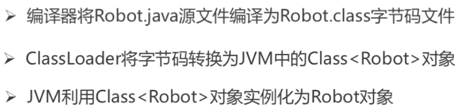

### 谈谈ClassLoader

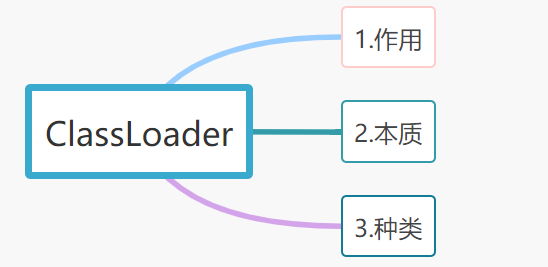

（1）作用

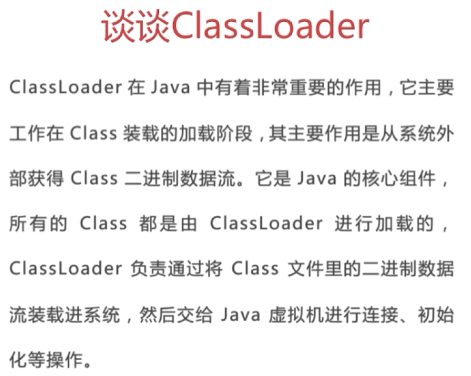

（1）ClassLoader的种类

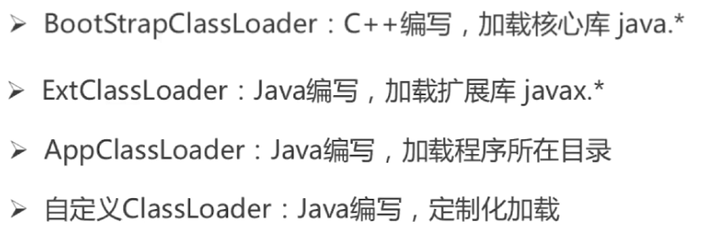

（2）自定义类加载器

```java
public class MyClassLoader extends ClassLoader {
    private String path;
    private String classLoaderName;

    public MyClassLoader(String path, 
                         String classLoaderName) {
        this.path = path;
        this.classLoaderName = classLoaderName;
    }

    //用于寻找类文件
    @Override
    public Class findClass(String name) {
        byte[] b = loadClassData(name);
        return defineClass(name, b, 0, b.length);
    }

    //用于加载类文件
    private byte[] loadClassData(String name) {
        name = path + name + ".class";
        InputStream in = null;
        ByteArrayOutputStream out = null;
        try {
            in = new FileInputStream(new File(name));
            out = new ByteArrayOutputStream();
            int i = 0;
            while ((i = in.read()) != -1) {
                out.write(i);
            }
        } catch (Exception e) {
            e.printStackTrace();
        } finally {
            try {
                out.close();
                in.close();
            } catch (Exception e) {
                e.printStackTrace();
            }
        }
        return out.toByteArray();
    }
}
```

校验我们写的自定义类加载器：

```java
public class ClassLoaderChecker {
    public static void main(String[] args){
        MyClassLoader m = new MyClassLoader("/Users/baidu/Desktop/", "myClassLoader");
        Class c = m.loadClass("Wali");
        System.out.println(c.getClassLoader());
        System.out.println(c.getClassLoader().getParent());
        System.out.println(c.getClassLoader().getParent().getParent());
        System.out.println(c.getClassLoader().getParent().getParent().getParent());
        c.newInstance();
    }
}

```

### 谈谈类加载器的双亲委派机制

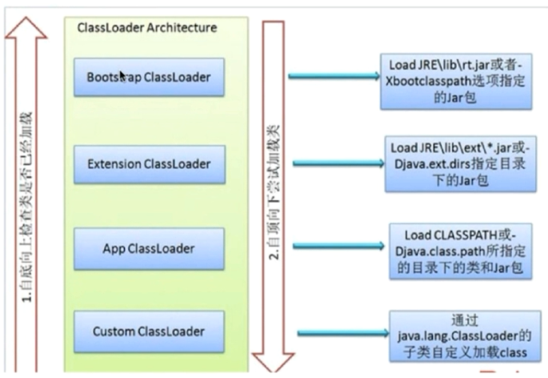

参考链接：<https://www.jianshu.com/p/353c26c744df>

#### （1）双亲委派机制

​	某个特定的类加载器在接到加载类的请求时，首先将加载任务委托给父类加载器，依次递归，如果父类加载器可以完成类加载任务，就成功返回；只有父类加载器无法完成此加载任务时，才自己去加载。

**双亲委派模型的工作过程是：**

- 如果一个类加载器收到了类加载的请求，它首先不会自己去尝试加载这个类，而是把这个请求委派给父类加载器去完成。
- 每一个层次的类加载器都是如此。因此，所有的加载请求最终都应该传送到顶层的启动类加载器中。
- 只有当父加载器反馈自己无法完成这个加载请求时（搜索范围中没有找到所需的类），子加载器才会尝试自己去加载。

#### （2）为什么要使用双亲委派机制去加载类？

​	1.只有当你使用该class的时候才会去装载，一个classloader只会装载同一个class一次。
​	2.不同的类加载器的实例所加载的字节码文件，其通过反射获取的对象不是相同类型（相互赋值会抛出类型强转异常）。即：判断两个类是否为同一对象的标准里面有一条是类加载器必须为相同。

​	3.双亲委派机制能在很大程度上防止内存中出现多个相同的字节码文件。

#### （3）实现原理

​	1.首先，检查目标类是否已在当前类加载器的命名空间中加载（即，使用二元组`<类加载器实例，全限定名>`区分不同类）。

​	2.如果没有找到，则尝试将请求委托给父类加载器（如果指定父类加载器为null，则将启动类加载器作为父类加载器；如果没有指定父类加载器，则将应用程序类加载器作为父类加载器），最终所有类都会委托到启动类加载器。

​	3.如果父类加载器加载失败，则自己加载。

​	4.默认resolve取false，不需要解析，直接返回。

### 类加载的方式


#### （1）类的装载过程

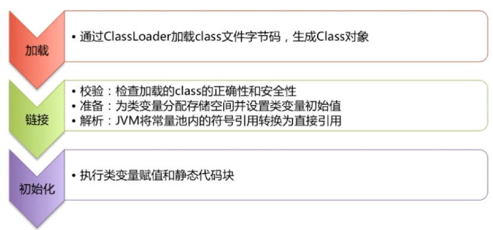

#### （2）loadClass和forName的区别？

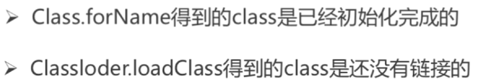

## 二、Java内存模型

### java的内存模型

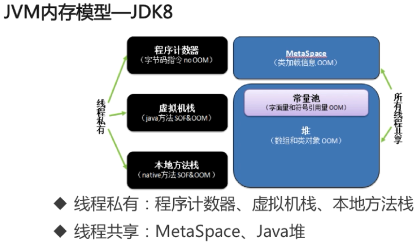

#### （1）程序计数器

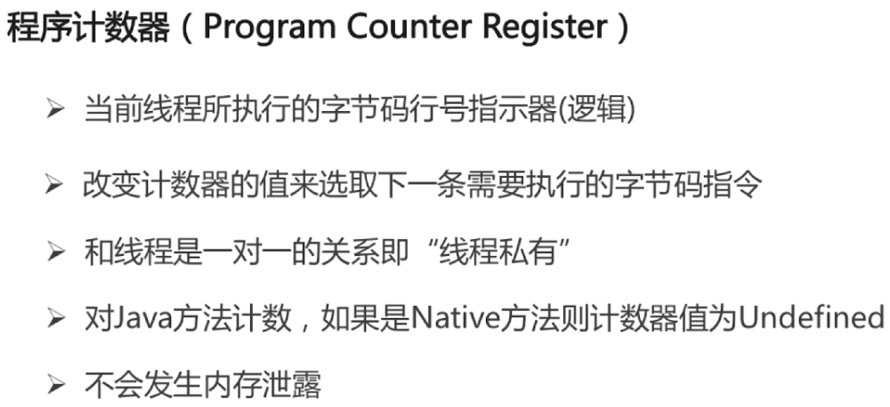

#### （2）java虚拟机栈

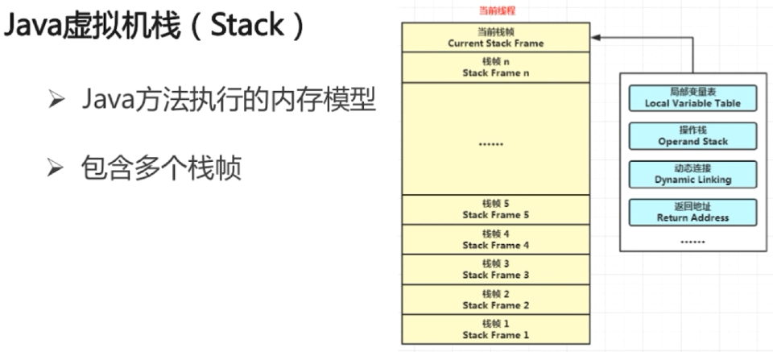

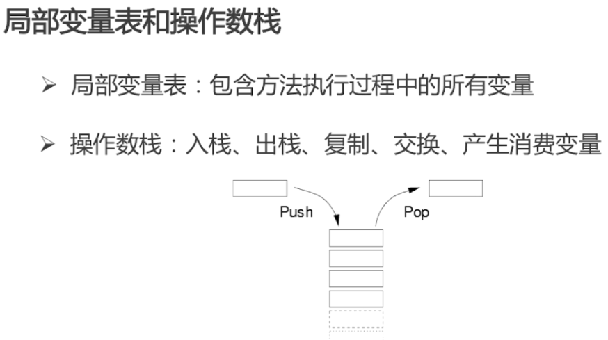

#### （3）虚拟机栈会引发的问题

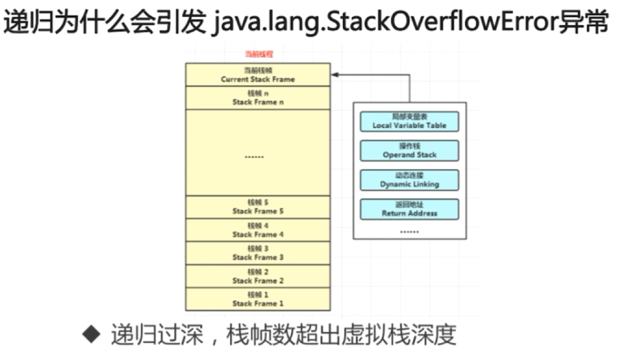

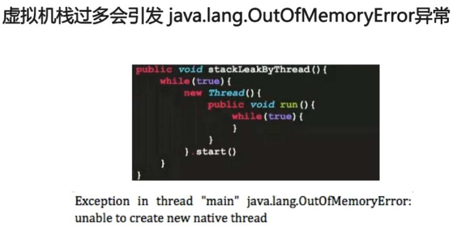

### 元空间

#### （1）元空间与永久代的区别

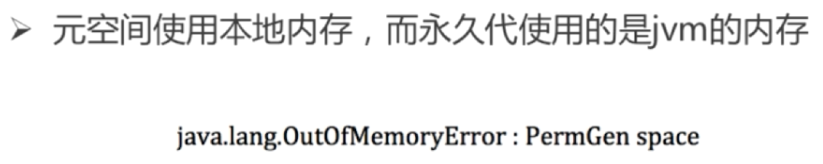

#### （2）元空间与永久代相比的优势


### 堆

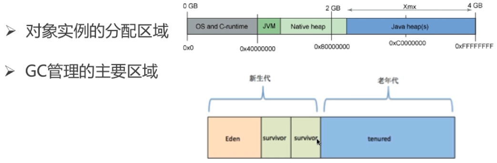

### 三大性能调优参数

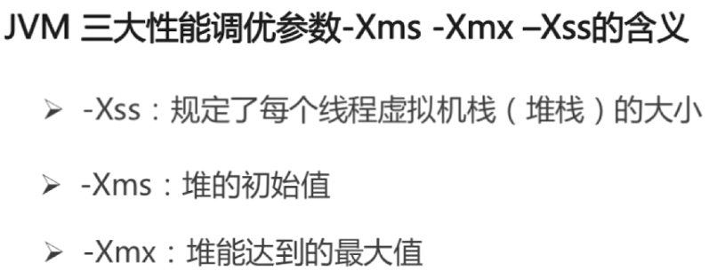

#### （1）内存分配策略


#### （2）堆和栈的区别

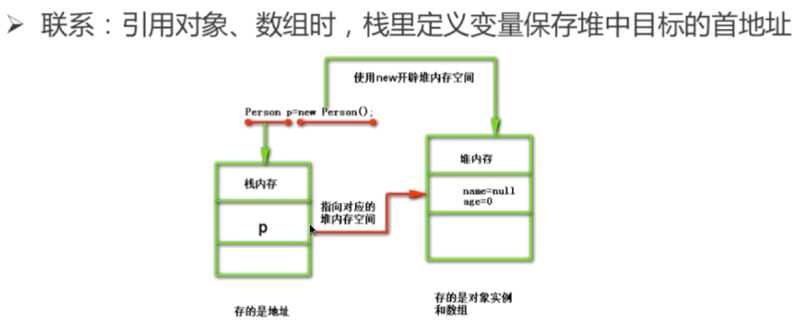

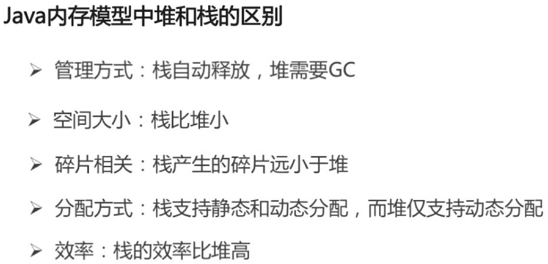

#### （3）元空间、堆、线程独占部分的联系-内存角度

```java
public class HelloWorld {
	private String name;
    public void setName(String name) {
        this.name = name;
    }
    public static void mian(String[] args){
    	int a = 1;
    	HelloWorld hw = new HelloWorld();
    	hw.setName("test");
    }
}
```

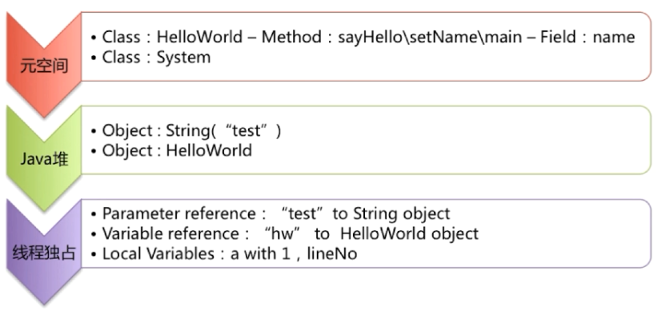

#### （4）intern()方法的区别

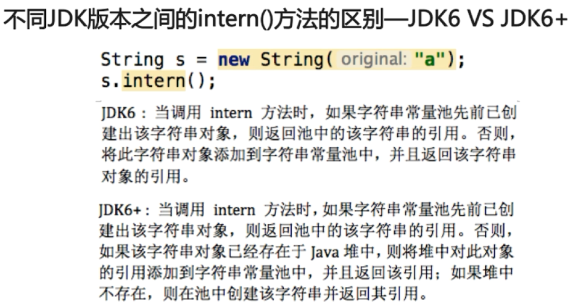

```java
public static void main(String[] args) {
    String s = new String("1");
    s.intern();
    String s2 = "1";
    System.out.println(s == s2);

    String s3 = new String("1") + new String("1");
    s3.intern();
    String s4 = "11";
    System.out.println(s3 == s4);
    // 打印结果是:
	// 	jdk6 下false false
	// 	jdk7 下false true
}
```

