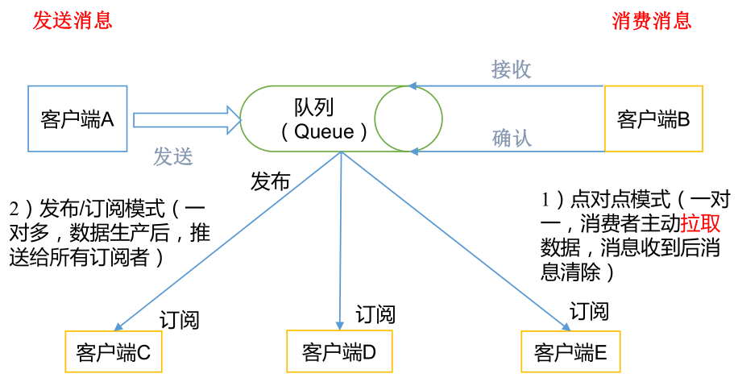
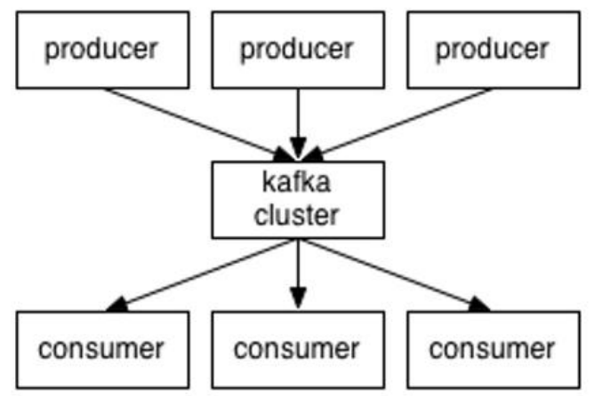

[TOC]

# 一、概述

Apache Kafka是一款开源的消息引擎系统。

## 消息队列内部实现原理

（1）**点对点模式**（一对一，消费者主动拉取数据，消息收到后消息清除）

点对点模型通常是一个基于拉取或者轮询的消息传送模型，这种模型从队列中请求信息，而不是将消息推送到客户端。这个模型的特点是发送到队列的消息被一个且只有一个接收者接收处理，即使有多个消息监听者也是如此。

（2）**发布/订阅模式**（一对多，数据生产后，推送给所有订阅者）

发布订阅模型则是一个基于推送的消息传送模型。发布订阅模型可以有多种不同的订阅者，临时订阅者只在主动监听主题时才接收消息，而持久订阅者则监听主题的所有消息，即使当前订阅者不可用，处于离线状态。

（3）**优缺点分析**

缺点：点对点模式下，客户端需要有一个线程实时监控队列中是否有数据。发布订阅模式，传输速度需要和所有客户端最小的一致，因而会造成带宽的浪费。

## 为什么需要消息队列？

**（1）解耦：**

　　允许你独立的扩展或修改两边的处理过程，只要确保它们遵守同样的接口约束。

**（2）冗余**

消息队列把数据进行持久化直到它们已经被完全处理，通过这一方式规避了数据丢失风险。许多消息队列所采用的"插入-获取-删除"范式中，在把一个消息从队列中删除之前，需要你的处理系统明确的指出该消息已经被处理完毕，从而确保你的数据被安全的保存直到你使用完毕。

**（3）扩展性**

因为消息队列解耦了你的处理过程，所以增大消息入队和处理的频率是很容易的，只要另外增加处理过程即可。

**（4）灵活性 & 峰值处理能力**

在访问量剧增的情况下，应用仍然需要继续发挥作用，但是这样的突发流量并不常见。如果为以能处理这类峰值访问为标准来投入资源随时待命无疑是巨大的浪费。使用消息队列能够使关键组件顶住突发的访问压力，而不会因为突发的超负荷的请求而完全崩溃。

**（5）可恢复性**

系统的一部分组件失效时，不会影响到整个系统。消息队列降低了进程间的耦合度，所以即使一个处理消息的进程挂掉，加入队列中的消息仍然可以在系统恢复后被处理。

**（6）顺序保证**

在大多使用场景下，数据处理的顺序都很重要。大部分消息队列本来就是排序的，并且能保证数据会按照特定的顺序来处理。（**Kafka保证一个Partition内的消息的有序性**）

**（7）缓冲**

有助于控制和优化数据流经过系统的速度，解决生产消息和消费消息的处理速度不一致的情况。

**（8）异步通信**

很多时候，用户不想也不需要立即处理消息。消息队列提供了异步处理机制，允许用户把一个消息放入队列，但并不立即处理它。想向队列中放入多少消息就放多少，然后在需要的时候再去处理它们。

## 什么是kafka?

在流式计算中，Kafka一般用来缓存数据，Storm通过消费Kafka的数据进行计算。

（1）Apache Kafka是一个开源**消息**系统，由Scala写成。是由Apache软件基金会开发的一个开源消息系统项目。

（2）Kafka最初是由LinkedIn公司开发，并于2011年初开源。2012年10月从Apache Incubator毕业。该项目的目标是为处理实时数据提供一个统一、高通量、低等待的平台。

（3）**Kafka是一个分布式消息队列**。Kafka对消息保存时根据Topic进行归类，发送消息者称为Producer，消息接受者称为Consumer，此外kafka集群有多个kafka实例组成，每个实例(server)称为broker。

（4）无论是kafka集群，还是consumer都依赖于**zookeeper**集群保存一些meta信息，来保证系统可用性。

## kafka架构

kafka整体架构图：

kafka详细架构图：

（1）Producer ：消息生产者，就是向kafka broker发消息的客户端；

（2）Consumer ：消息消费者，向kafka broker取消息的客户端；

（3）Topic ：可以理解为一个队列；

（4） Consumer Group （CG）：这是kafka用来实现一个topic消息的广播（发给所有的consumer）和单播（发给任意一个consumer）的手段。一个topic可以有多个CG。topic的消息会复制（不是真的复制，是概念上的）到所有的CG，但每个partion只会把消息发给该CG中的一个consumer。如果需要实现广播，只要每个consumer有一个独立的CG就可以了。要实现单播只要所有的consumer在同一个CG。用CG还可以将consumer进行自由的分组而不需要多次发送消息到不同的topic；

（5）Broker ：一台kafka服务器就是一个broker。一个集群由多个broker组成。一个broker可以容纳多个topic；

（6）Partition：为了实现扩展性，一个非常大的topic可以分布到多个broker（即服务器）上，一个topic可以分为多个partition，每个partition是一个有序的队列。partition中的每条消息都会被分配一个有序的id（offset）。kafka只保证按一个partition中的顺序将消息发给consumer，不保证一个topic的整体（多个partition间）的顺序；

（7）Offset：kafka的存储文件都是按照offset.kafka来命名，用offset做名字的好处是方便查找。例如你想找位于2049的位置，只要找到2048.kafka的文件即可。当然the first offset就是00000000000.kafka。

# 二、Kafka工作流程分析

## kafka生产过程分析

## broker保存消息

## kafka消费过程分析

# 

# 

