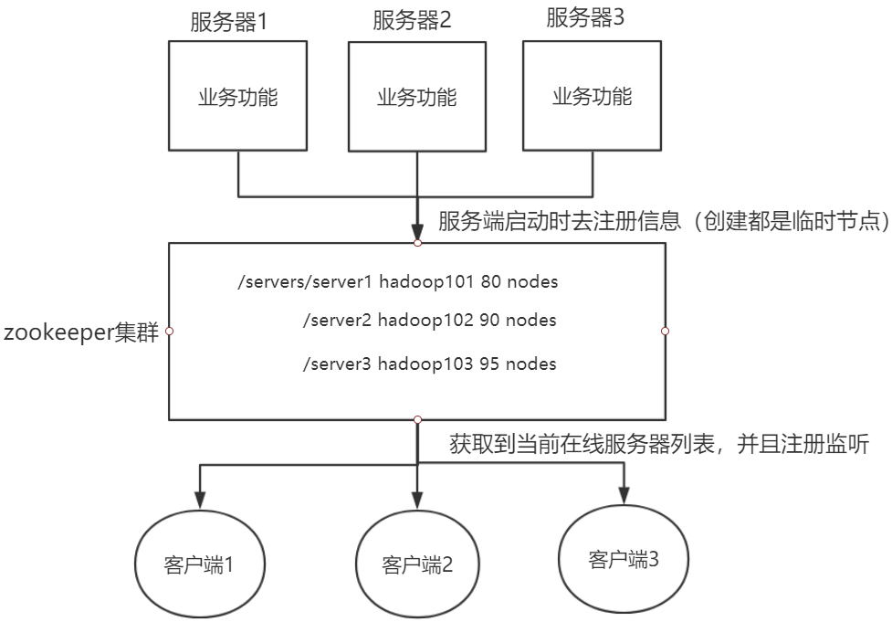
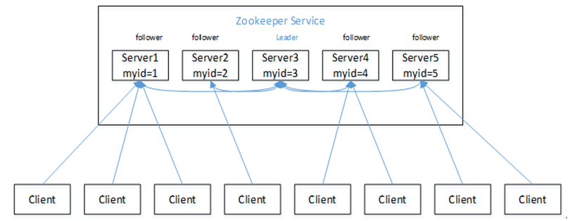
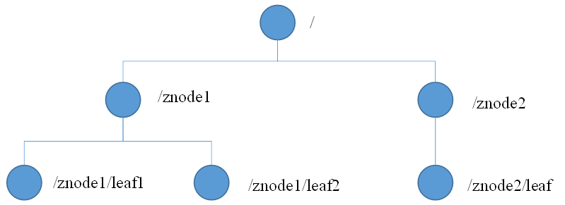
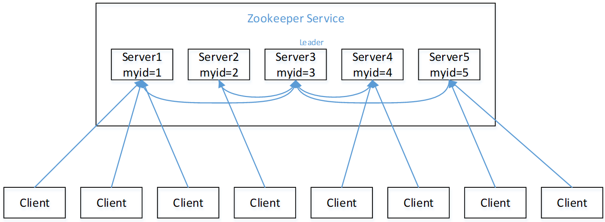
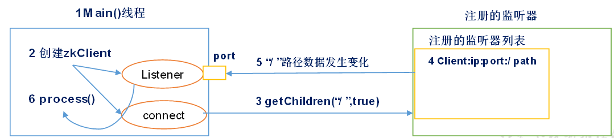

[TOC]

## 一、zookeeper概述

zookeeper是一个开源的分布式的，为分布式应用提供协调服务的apache项目。

### zookeeper的工作机制

zookeeper从设计模式的角度来理解：是一个基于观察者模式设计的分布式服务管理框架，它**负责存储和管理大家都关心的数据**，然后**接受观察者的注册**，以但这些数据的状态发生变化，zookeeper就将**负责通知已经在zookeeper上注册的那些观察者**做出相应的反应。

- 首先，服务端启动时去注册信息（创建都是临时节点）；
- 客户端获取到当前在线服务器列表，并且注册监听；
- 若是服务器节点下线，客户端的监听程序则会收到服务器节点上下线事件通知；
- 客户端调用相应的process(){重新再去获取服务器列表，并注册监听}

## 二、特点

1）zookeeper: 一个领导者（Leader）,多个跟随着（follower）组成的集群。

2）**集群中只要有半数以上的节点存乎哦，zookeeper集群就能正常服务。**

3）全局数据一致：每个server保存一份相同的数据据副本，Client无论连接到哪个server,数据都是一致的。

4）更新请求顺序进行，来自同一个client的更新请求按其发送顺序依次执行。

5）数据更新原子性，依次数据更新要么成功，要么失败。

6）实时性，在一定事件范围内，client能读到最新数据（server保存的数据很小）。

## 三、数据结构

zookeeper数据模型的结构与**Unix文件系统很类似**，整体上可以看作是一棵树，每个节点称作一个ZNode。灭一个ZNode默认能够存储**1MB**的数据，每个ZNode都可以**通过其路径唯一标识**。

## 四、应用场景

zookeeper提供的服务包括：统一命名服务、统一配置管理、统一集群管理、服务器节点动态上下线、软负载均衡等。

### (1)统一命名服务

在分布式环境下，经常需要对需要应用/服务进行统一命名，便于识别。

例如：IP不容易记住，而域名容易记住。

域名：www.baidu.com 

IP:192.XXX.XXX.XXX

最终，由域名管理者确定，每个客户端具体访问哪台服务器。

### （2）统一配置管理

1）分布式环境下，配置文件同步非常常见

- 一般要求一个急群众，所有的配置信息是一致的，比如kafka集群。
- 对于配置文件修改后，希望能够快速同步到各个节点上。

2）配置管理可交友zookeeper实现

- 可将配置信息写入zookeeper上的一个ZNode
- 各个客户端服务器监听这个ZNode
- 一旦ZNode中的数据被修改，zookeeper将通知各个客户端服务器

### （3）统一集群管理

### （4）服务器节点动态上下线

### （5）软负载均衡

## 五、选举机制

（1）服务器1启动，此时只有它一台服务器启动了，它发出去的报文没有任何响应，所以它的选举状态一直是LOOKING状态。

（2）服务器2启动，它与最开始启动的服务器1进行通信，互相交换自己的选举结果，由于两者都没有历史数据，所以id值较大的服务器2胜出，但是由于没有达到超过半数以上的服务器都同意选举它(这个例子中的半数以上是3)，所以服务器1、2还是继续保持LOOKING状态。

（3）服务器3启动，根据前面的理论分析，服务器3成为服务器1、2、3中的老大，而与上面不同的是，此时有三台服务器选举了它，所以它成为了这次选举的Leader。

（4）服务器4启动，根据前面的分析，理论上服务器4应该是服务器1、2、3、4中最大的，但是由于前面已经有半数以上的服务器选举了服务器3，所以它只能接收当小弟的命了。

（5）服务器5启动，同4一样当小弟。

## 六、写数据流程

（1）Client 向 ZooKeeper 的 Server1 上写数据，发送一个写请求。

（2）如果Server1不是Leader，那么Server1 会把接受到的请求进一步转发给Leader，因为每个ZooKeeper的Server里面有一个是Leader。这个Leader 会将写请求广播给各个Server，比如Server1和Server2，各个Server写成功后就会通知Leader。

（3）当Leader收到大多数 Server 数据写成功了，那么就说明数据写成功了。如果这里三个节点的话，只要有两个节点数据写成功了，那么就认为数据写成功了。写成功之后，Leader会告诉Server1数据写成功了。

（4）Server1会进一步通知 Client 数据写成功了，这时就认为整个写操作成功。ZooKeeper 整个写数据流程就是这样的。

## 七、监听原理

（1）zookeeper客户端会创建两个线程，一个负责网络连接通信（connect）,一个负责监听（listener）.

（2）通过connect线程将注册信息发送给zookeeper;

（3）zookeeper监听到有数据或者路径变化，就会将这个消息发送给listener线程；

（4）listener线程内部调用了process()方法进行处理。

