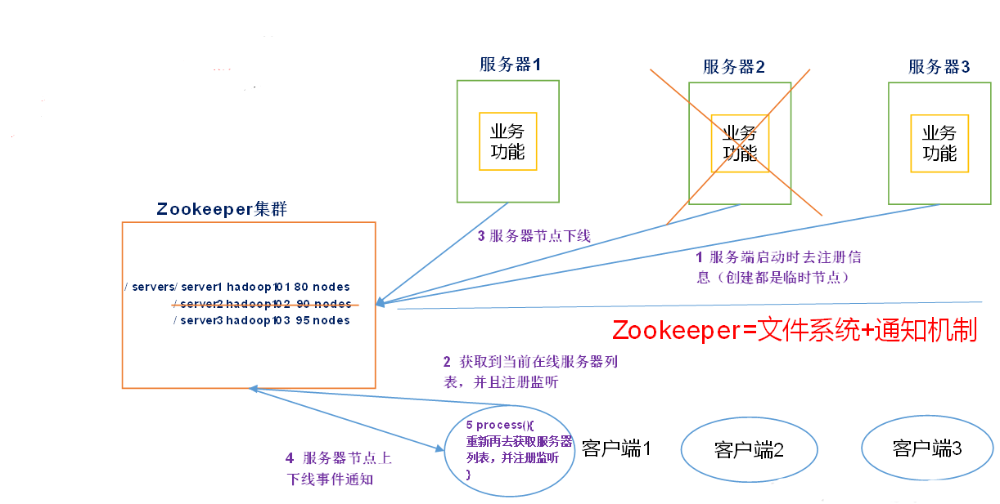

[TOC]

## 一、zookeeper概述

zookeeper是一个开源的分布式的，为分布式应用提供协调服务的apache项目。

### zookeeper的工作机制

zookeeper从设计模式的角度来理解：是一个基于观察者模式设计的分布式服务管理框架，它**负责存储和管理大家都关心的数据**，然后**接受观察者的注册**，以但这些数据的状态发生变化，zookeeper就将**负责通知已经在zookeeper上注册的那些观察者**做出相应的反应。

## 二、特点

1）zookeeper: 一个领导者（Leader）,多个跟随着（follower）组成的集群。

2）**集群中只要有半数以上的节点存乎哦，zookeeper集群就能正常服务。**

3）全局数据一致：每个server保存一份相同的数据据副本，Client无论连接到哪个server,数据都是一致的。

4）更新请求顺序进行，来自同一个client的更新请求按其发送顺序依次执行。

5）数据更新原子性，依次数据更新要么成功，要么失败。

6）实时性，在一定事件范围内，client能读到最新数据（server保存的数据很小）。

## 三、数据结构

zookeeper数据模型的结构与**Unix文件系统很类似**，整体上可以看作是一棵树，每个节点称作一个ZNode。灭一个ZNode默认能够存储**1MB**的数据，每个ZNode都可以**通过其路径唯一标识**。

## 四、应用场景

zookeeper提供的服务包括：统一命名服务、统一配置管理、统一集群管理、服务器节点动态上下线、软负载均衡等。

### (1)统一命名服务

在分布式环境下，经常需要对需要应用/服务进行统一命名，便于识别。

例如：IP不容易记住，而域名容易记住。

域名：www.baidu.com 

IP:192.XXX.XXX.XXX

最终，由域名管理者确定，每个客户端具体访问哪台服务器。

## 五、选举机制

## 六、节点类型

## 七、

