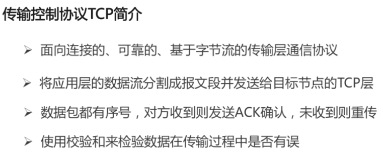
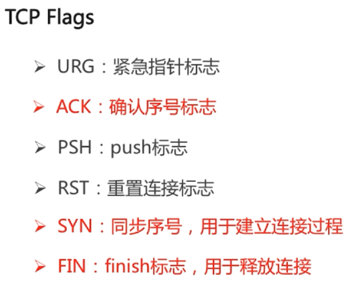
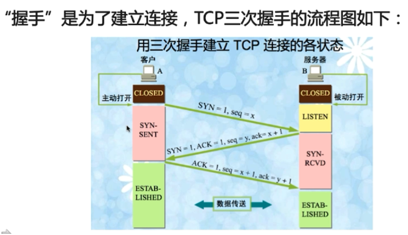
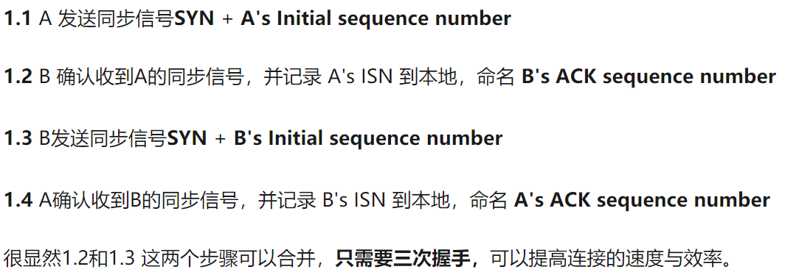
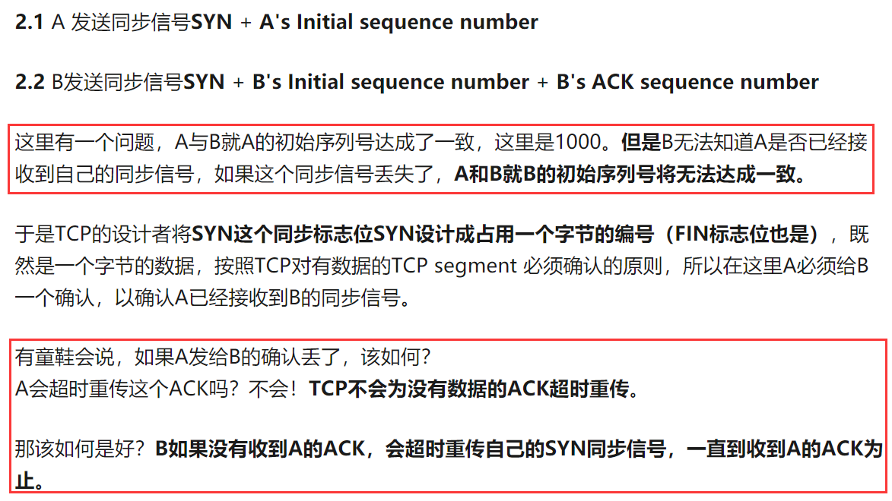
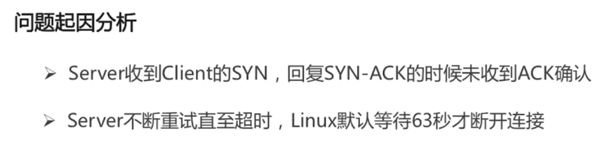

## 一、TCP

### 1.tcp简介

### 2.三次挥手

​	在 TCP / IP 协议中， TCP 协议提供可弃的连接服务，采用三次提手建立一个连接。

（1）**第一次握手**：建立连接时．客户端发送 SYN 包（syn=j） 到服务器。并进入 SYN _SEND 状态，等待服务器确认；

（2）**第二次握手**：服务器收到SYN 包，必须确认客户的 SYN ( ack=j+1 ) ．同时自己也发送一个 SYN 包（ syn=k) ，即 SYN  + ACK 包．此时服务器进入 SYN _ RECV 状态；

（3）**第三次握手**：客户端收到服务器的 SYN + ACK 包，向服务器发送确认ACK(ack=k+1),此包发送完毕，客户端和服务器进入ESTABLISHED 状态，完成三次握手。

### 3.为什么不是2次握手，4次握手？

参考链接：<https://www.zhihu.com/question/24853633>

**（1）四次握手**

**（2）两次握手**

### 4.首次握手的问题（SYN超时）？

这种方式是攻击者利用

### 3.四次挥手

## 二、UDP

## 三、Http

## 四、